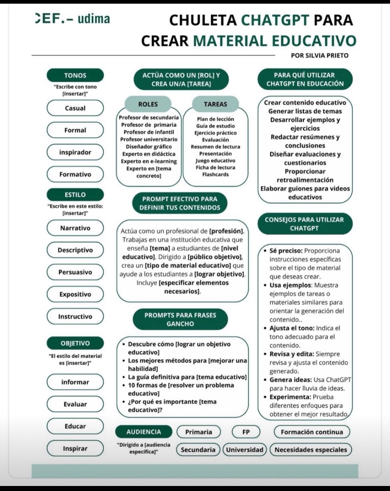

# Inteligencia Artificial

La inteligencia artificial es una rama de la informática que busca desarrollar algoritmos y sistemas capaces de realizar tareas que requieren inteligencia humana, como el aprendizaje, la toma de decisiones, la comprensión del lenguaje natural, el reconocimiento de patrones y la visión por computadora.

La inteligencia artificial se basa en el uso de algoritmos y modelos matemáticos que permiten a los sistemas aprender de los datos, y su aplicación abarca una amplia gama de campos, desde la automatización de procesos industriales hasta la asistencia en el diagnóstico médico o la creación de sistemas de recomendación en el comercio electrónico.

- [Recursos _IA_](#recursos-ia).
- [Herramientas _IA_](#herramientas-ia).

---

## Recursos _IA_

### Empresas _IA_

- https://openai.com/
- https://stability.ai/
- https://deepmind.google/

### Comunidades _IA_

- https://huggingface.co/

### Video Tutoriales _IA_

- [Las mejores herramientas de IA en 2024](https://www.youtube.com/watch?v=o0psJ260Rgg).
- [Errores que cometes al usar ChatGPT](https://www.youtube.com/watch?v=JOJpO-q2dW8).

### Recomendaciones para escribir _prompts_

[🔼 Regresar](#inteligencia-artificial)

---

## Herramientas _IA_

- [Herramientas según Profesión](https://evolupedia.com/herramientas-ia/)

### Buscadores

- https://gemini.google.com/
- https://copilot.microsoft.com/
- https://www.bing.com/

### Texto

- https://chat.openai.com/chat
- https://www.perplexity.ai/
- https://mistral.ai/
- https://writer.com/ai-content-detector/
- https://www.copy.ai/
- https://rytr.me/
- https://headlime.com/

### Imagen

- https://firefly.adobe.com/
- https://lexica.art/
- https://www.midjourneyai.ai/es/free-trial
- https://ideogram.ai/login
- https://leonardo.ai/
- https://clipdrop.co/stable-diffusion-turbo
- https://stablediffusionweb.com/
- https://godinabox.co/
- https://creator.nightcafe.studio/
- https://this-person-does-not-exist.com/es
- https://thisxdoesnotexist.com/
- https://pfpmaker.com/
- https://magicstudio.com/es/

### Identidad de Marca

- https://namelix.com/
- https://www.design.com/
- https://brandmark.io/
- https://brandmark.io/tools/
- https://app.brandmark.io/v3/

### _UI_

- https://www.usegalileo.ai/
- https://uizard.io/

### Audio

- https://elevenlabs.io/
- https://www.stableaudio.com/
- https://www.naturalreaders.com/
- https://boomy.com/
- https://www.udio.com/
- https://suno.com/

### Video

- https://www.synthesia.io/
- https://pixverse.ai/
- https://openai.com/sora
- https://pika.art/
- https://runwayml.com/
- https://www.narakeet.com/
- https://www.genmo.ai/
- https://haiper.ai/
- https://noisee.ai/
- https://pixverse.ai/

### Presentaciones

- https://tome.app/

[🔼 Regresar](#inteligencia-artificial)

---
