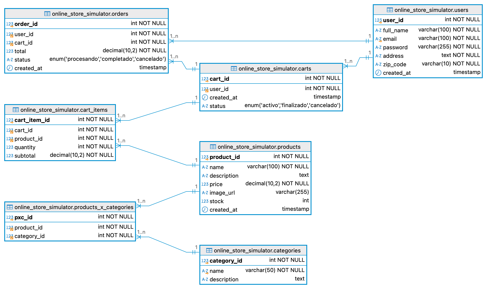

# Modelado de Datos Simulador de Tienda en Línea

Para modelar la base de datos de un simulador de tienda en línea con un sistema de carrito de compras y registro de usuarios, necesitamos considerar las entidades principales y sus relaciones. El diseño debe permitir almacenar información sobre usuarios, productos, carritos de compras, y pedidos.

## Modelo Entidad-Relación (E-R):

### Entidades

#### Usuarios (_users_)

Esta tabla almacena la información de los usuarios registrados en la tienda.

- **`user_id (PK)`**: Identificador único para cada usuario.
- `name`: Nombre del usuario.
- `email`: Correo electrónico del usuario (valor único).
- `password`: Contraseña cifrada del usuario.
- `address`: Dirección de envío del usuario.
- [`zip_code`](https://worldpostalcode.com): Código postal de la dirección del usuario.
- `created_at`: Fecha y hora de creación del usuario.

#### Productos (_products_)

Esta tabla almacena la información de los productos disponibles en la tienda.

- **`product_id (PK)`**: Identificador único para cada producto.
- `name`: Nombre del producto.
- `description`: Descripción del producto.
- `price`: Precio del producto.
- `image_url`: URL de la imagen del producto.
- `category`: Categoría a la que pertenece el producto.
- `stock:` Cantidad disponible en inventario.
- `created_at`: Fecha y hora de creación del producto.

#### Categorías (_categories_)

Esta tabla almacena la información de las categorías a las que pueden pertenecer los productos.

- **`category_id (PK)`**: Identificador único de la categoría.
- `name`: Nombre de la categoría (valor único).
- `description`: Descripción de la categoría.

#### Productos por Categorías (_products_x_categories_)

Esta tabla relaciona los productos con sus respectivas categorías.

- **`pxc_id (PK)`**: Identificador único de la relación producto y categoría.
- **`product_id (FK)`**: Identificador del producto.
- **`category_id (FK)`**: Identificador de la categoría.

#### Carritos de Compras (_carts_)

Esta tabla almacena los carritos de compras creados por los usuarios.

- **`cart_id (PK)`**: Identificador único para cada carrito.
- **`user_id (FK)`**: Identificador del usuario propietario del carrito.
- `created_at`: Fecha y hora de creación del carrito.
- `status`: Estado del carrito (activo, finalizado, cancelado).

#### _Items_ del Carrito (_cart_items_)

Esta tabla almacena los _items_ que han sido añadidos a los carritos de compras.

- **`cart_item_id (PK)`**: Identificador único para cada _item_ del carrito.
- **`cart_id (FK)`**: Identificador del carrito al que pertenece el _item_.
- **`product_id (FK)`**: Identificador del producto correspondiente.
- `quantity`: Cantidad del producto en el carrito.
- `subtotal`: Precio total del _item_, atributo calculado como `quantity * price`.

#### Pedidos (_orders_)

Esta tabla almacena los pedidos realizados por los usuarios.

- **`order_id (PK)`**: Identificador único para cada pedido.
- **`user_id (FK)`**: Identificador del usuario que realizó el pedido.
- **`cart_id (FK)`**: Identificador del carrito asociado al pedido.
- `total`: Monto total del pedido.
- `status`: Estado del pedido (procesado, completado, cancelado).
- `created_at`: Fecha y hora de creación del pedido.

### Relaciones

1. Un usuario puede tener múltiples carritos, pero un carrito pertenece a un único usuario. **`(1 - M)`**.
1. Un carrito puede contener múltiples _items_, pero un _item_ pertenece a un único carrito. **`(1 - M)`**.
1. Un _item_ en el carrito está asociado con un único producto, pero un producto puede estar en múltiples _items_ de diferentes carritos **`(1 - M)`**.
1. Un usuario puede realizar múltiples pedidos, pero un pedido pertenee a un único usuario **`(1 - M)`**.
1. Cada pedido está asociado con un carrito y viceversa **`(1 - 1)`**.
1. Un producto puede pertenecer a múltiples categorías, y una categoría puede contener múltiples productos. **`(M - M)`**.

### Diagrama Modelo Entidad-Relación (E-R):

### Código de la Base de Datos

- [Código _SQL_ de la Base de Datos](./p-9.sql).
