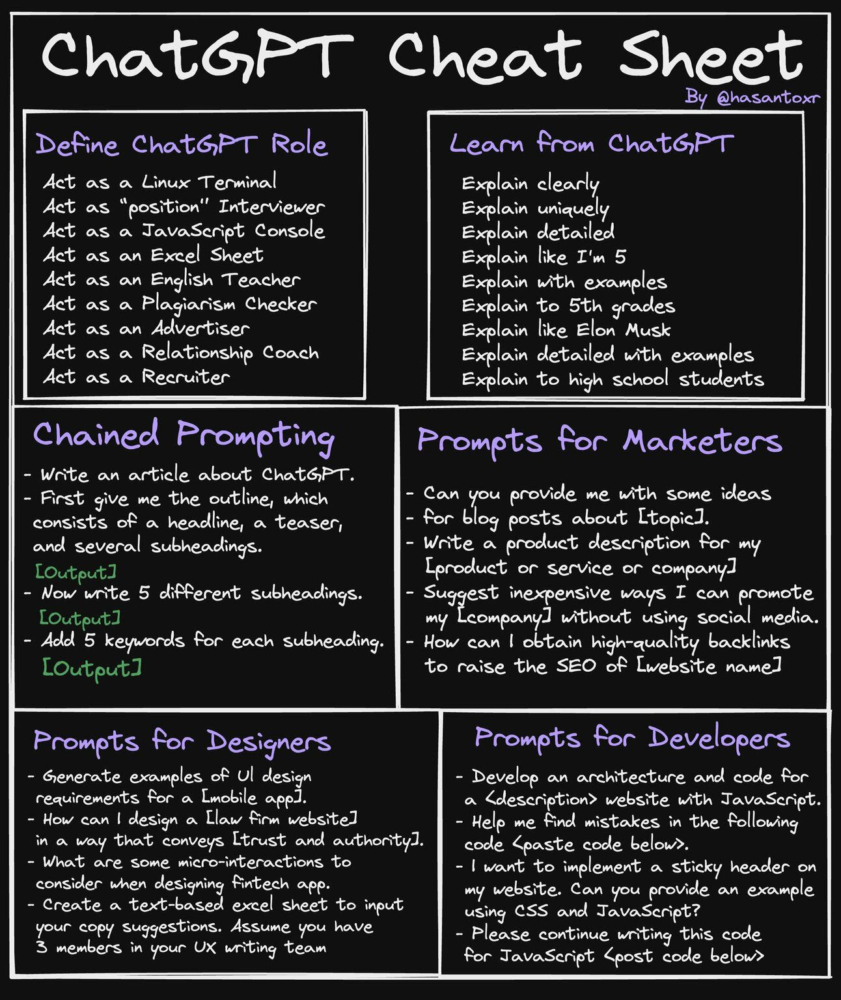
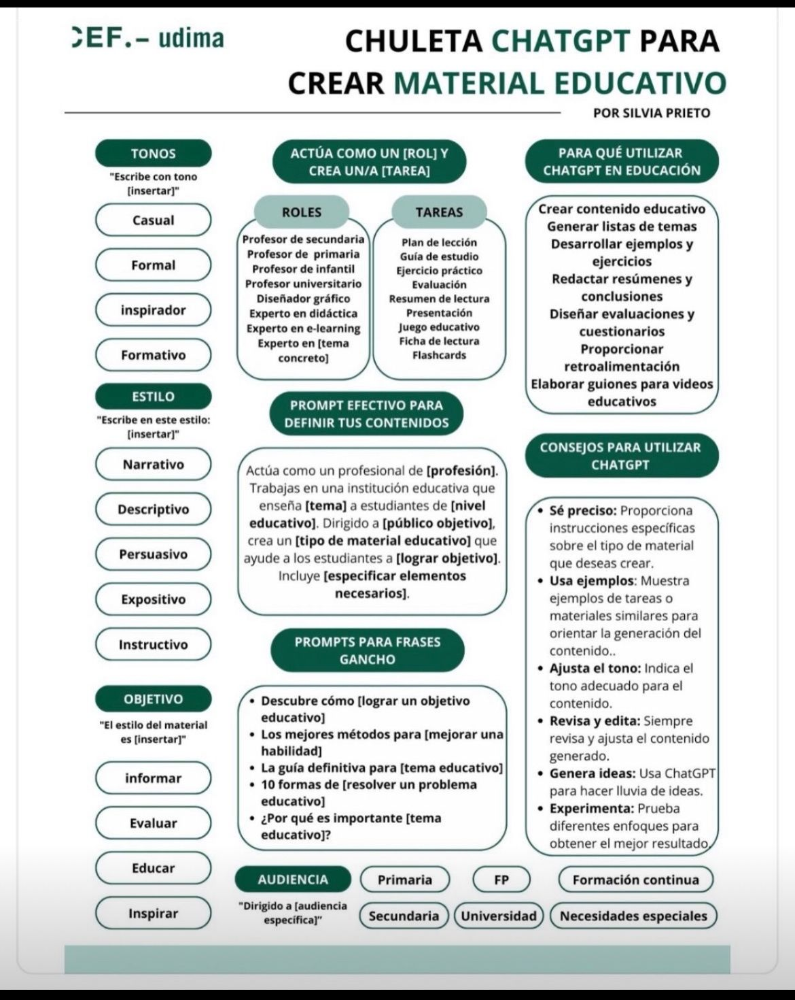

# Inteligencia Artificial

La inteligencia artificial es una rama de la informática que busca desarrollar algoritmos y sistemas capaces de realizar tareas que requieren inteligencia humana, como el aprendizaje, la toma de decisiones, la comprensión del lenguaje natural, el reconocimiento de patrones y la visión por computadora.

La inteligencia artificial se basa en el uso de algoritmos y modelos matemáticos que permiten a los sistemas aprender de los datos, y su aplicación abarca una amplia gama de campos, desde la automatización de procesos industriales hasta la asistencia en el diagnóstico médico o la creación de sistemas de recomendación en el comercio electrónico.

- [Recursos _IA_](#recursos-ia).
- [Herramientas _IA_](#herramientas-ia).

---

## Recursos _IA_

### Video Tutoriales _IA_

- [Canal de Mari Fuentes](https://www.youtube.com/@MariFuentes/videos).
- [Canal de Andrea Bytes](https://www.youtube.com/@andreabytes/videos).
- [Errores que cometes al usar ChatGPT](https://www.youtube.com/watch?v=JOJpO-q2dW8).

### Recomendaciones para escribir _prompts_

[🔼 Regresar](#inteligencia-artificial)

---

## Herramientas _IA_

- [Herramientas según Profesión](https://evolupedia.com/herramientas-ia/)
- https://huggingface.co/

### _Suites_

- https://chat.openai.com/chat
- https://aistudio.google.com/
- https://www.deepseek.com/
- https://qwenlm.ai/
- https://endless.io/es
- https://claude.ai/
- https://mistral.ai/

### Buscadores

- https://www.perplexity.ai/
- https://gemini.google.com/
- https://copilot.microsoft.com/
- https://www.bing.com/

### Redes Sociales

- [_Meta AI_ de _Meta_](https://www.meta.ai/)
- [_Grok_ de _X_](https://x.com/i/grok)

### Texto

- https://writer.com/ai-content-detector/ (Detector de IA)
- https://rytr.me/
- https://www.copy.ai/
- https://headlime.com/

### Imagen

- https://www.piclumen.com/ (100% Free)
- https://www.blinkshot.io/ (100% Free)
- https://www.loras.dev/ (100% Free)
- https://redpandaai.com/ (100% Free)
- https://firefly.adobe.com/
- https://www.midjourney.com/
- https://leonardo.ai/ (Suite Multimedia)
- https://clipdrop.co/ (Edición de imagen con IA)
- https://stablediffusionweb.com/ (10 img Free al día)
- https://tungsten.run/ (10 img Free al día)
- https://this-person-does-not-exist.com/es (Free)
- https://thisxdoesnotexist.com/ (Free)
- https://pfpmaker.com/ (Profile Picture Free)
- https://lexica.art/
- https://ideogram.ai/
- https://magicstudio.com/es/
- https://www.recraft.ai/
- https://creator.nightcafe.studio/

### Identidad de Marca

- https://namelix.com/
- https://www.design.com/
- https://brandmark.io/
- https://brandmark.io/tools/
- https://app.brandmark.io/v3/

### _UI_

- https://uizard.io/
- https://www.usegalileo.ai/

### Audio

- https://elevenlabs.io/
- https://www.stableaudio.com/
- https://suno.com/
- https://mixkit.co/ (Recursos de Audio y Video)
- https://www.naturalreaders.com/ (Text to Speech)
- https://boomy.com/ (Creación de música)
- https://www.udio.com/ (Creación de música)
- https://www.notta.ai/es (Speech to Text)

### Video

- https://invideo.io/
- https://viggle.ai/ (Generador de video memes)
- https://similarvideo.ai/ (extracción de clips de video)
- https://lumalabs.ai/
- https://www.genmo.ai/
- https://hailuoai.video/
- https://www.krea.ai/
- https://nexusclips.com/ (extracción de clips de video)
- https://instadoodle.com/
- https://fliki.ai/
- https://www.synthesia.io/ (Avatares y doblaje)
- https://pixverse.ai/
- https://openai.com/sora
- https://pika.art/
- https://runwayml.com/
- https://haiper.ai/
- https://pixverse.ai/
- https://gencraft.com/
- https://klingai.com/

### Presentaciones

- https://tome.app/

### Automatizaciones

- https://www.make.com/
- https://n8n.io/

### Editores de Código

- https://github.com/copilot
- https://replit.com/
- https://bolt.new/
- https://bolt.diy
- https://v0.dev/
- https://www.trae.ai/

### Videojuegos

- https://deepmind.google/discover/blog/genie-2-a-large-scale-foundation-world-model/
- https://www.youtube.com/watch?v=x6Dy-8O0gEg

[🔼 Regresar](#inteligencia-artificial)

---
